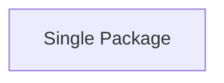
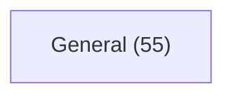
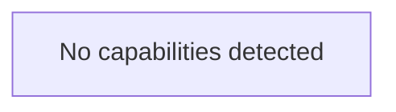
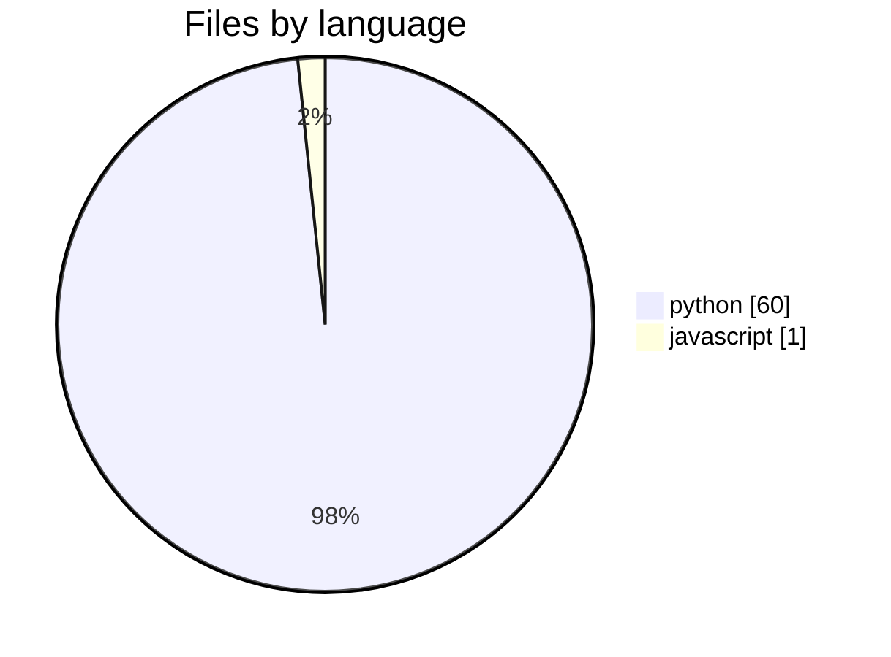
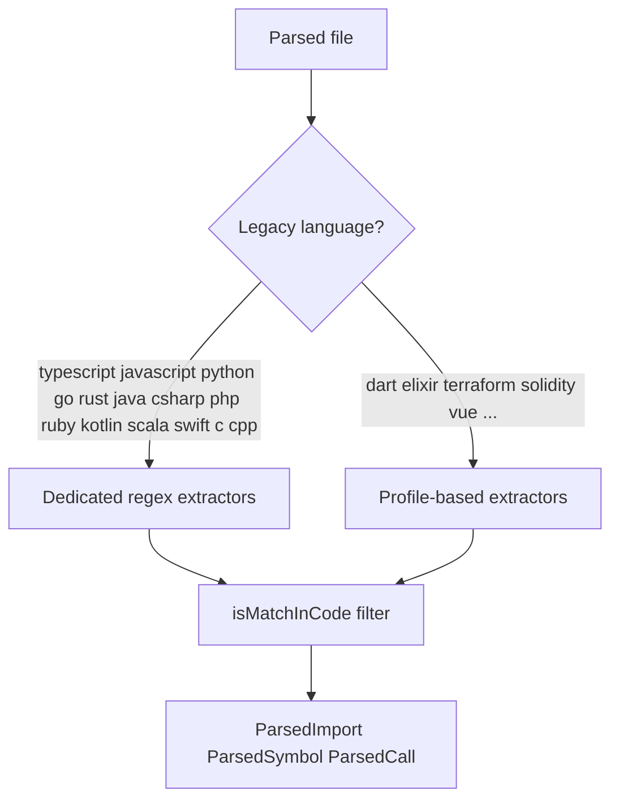
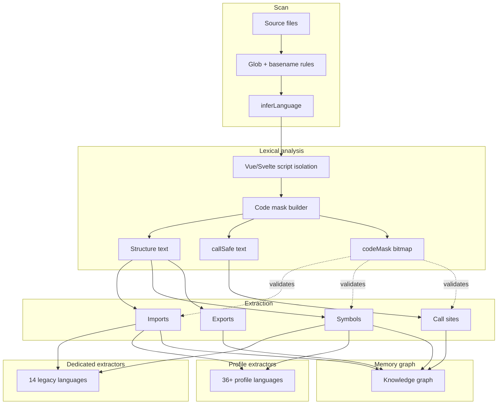

# Architecture — probes

## System Type

Single Package

## Layers

## Services

## Architecture layers

## Domain overview

## Capabilities map

## Languages & parsing

**Detected in this repo:** python (60), javascript (1)

Mnemos uses a lexical code-mask pipeline (52 languages engine-wide). Imports and symbols are extracted only from real code regions — not comments, strings, or Vue templates.

