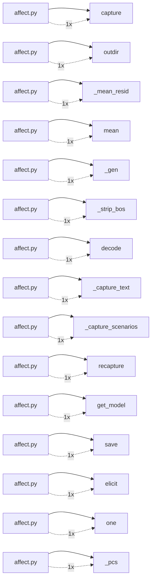

# Key Dependencies

Top dependency relationships by frequency.

## Dependency graph (top edges)

## Service dependency graph

- **affect.py → capture**: 1 references
- **affect.py → outdir**: 1 references
- **affect.py → _mean_resid**: 1 references
- **affect.py → mean**: 1 references
- **affect.py → _gen**: 1 references
- **affect.py → _strip_bos**: 1 references
- **affect.py → decode**: 1 references
- **affect.py → _capture_text**: 1 references
- **affect.py → _capture_scenarios**: 1 references
- **affect.py → recapture**: 1 references
- **affect.py → get_model**: 1 references
- **affect.py → save**: 1 references
- **affect.py → elicit**: 1 references
- **affect.py → one**: 1 references
- **affect.py → _pcs**: 1 references
- **affect.py → _unit**: 1 references
- **affect.py → norm**: 1 references
- **affect.py → _vectors**: 1 references
- **affect.py → sel**: 1 references
- **affect.py → _pairwise_cos**: 1 references
- **affect.py → _center**: 1 references
- **affect.py → build**: 1 references
- **affect.py → load**: 1 references
- **affect.py → report**: 1 references
- **affect.py → curve**: 1 references
- **affect.py → peak**: 1 references
- **affect2.py → a2dir**: 1 references
- **affect2.py → _load_vectors**: 1 references
- **affect2.py → load**: 1 references
- **affect2.py → _all_resid**: 1 references
