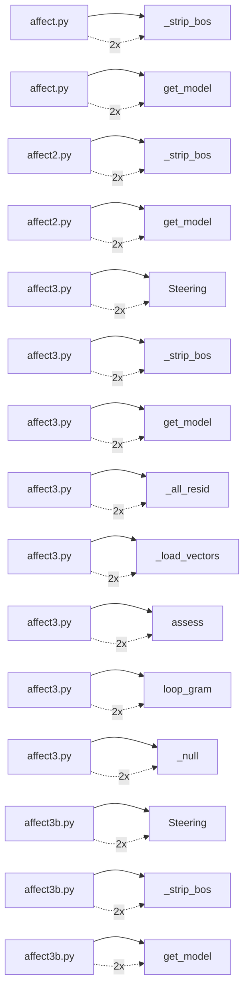

# Key Dependencies

Top dependency relationships by frequency.

## Dependency graph (top edges)

## Service dependency graph

- **affect.py → _strip_bos**: 2 references
- **affect.py → get_model**: 2 references
- **affect2.py → _strip_bos**: 2 references
- **affect2.py → get_model**: 2 references
- **affect3.py → Steering**: 2 references
- **affect3.py → _strip_bos**: 2 references
- **affect3.py → get_model**: 2 references
- **affect3.py → _all_resid**: 2 references
- **affect3.py → _load_vectors**: 2 references
- **affect3.py → assess**: 2 references
- **affect3.py → loop_gram**: 2 references
- **affect3.py → _null**: 2 references
- **affect3b.py → Steering**: 2 references
- **affect3b.py → _strip_bos**: 2 references
- **affect3b.py → get_model**: 2 references
- **affect3b.py → _load_vectors**: 2 references
- **affect3b.py → AffectSteer**: 2 references
- **affect3b.py → _null**: 2 references
- **affect3c.py → Steering**: 2 references
- **affect3c.py → _strip_bos**: 2 references
- **affect3c.py → get_model**: 2 references
- **affect3c.py → _load_vectors**: 2 references
- **affect3c.py → AffectSteer**: 2 references
- **affect3c.py → assess**: 2 references
- **affect3c.py → loop_gram**: 2 references
- **affect3c.py → _null**: 2 references
- **affect3g.py → Steering**: 2 references
- **affect3g.py → _strip_bos**: 2 references
- **affect3g.py → get_model**: 2 references
- **affect3g.py → _load_vectors**: 2 references
