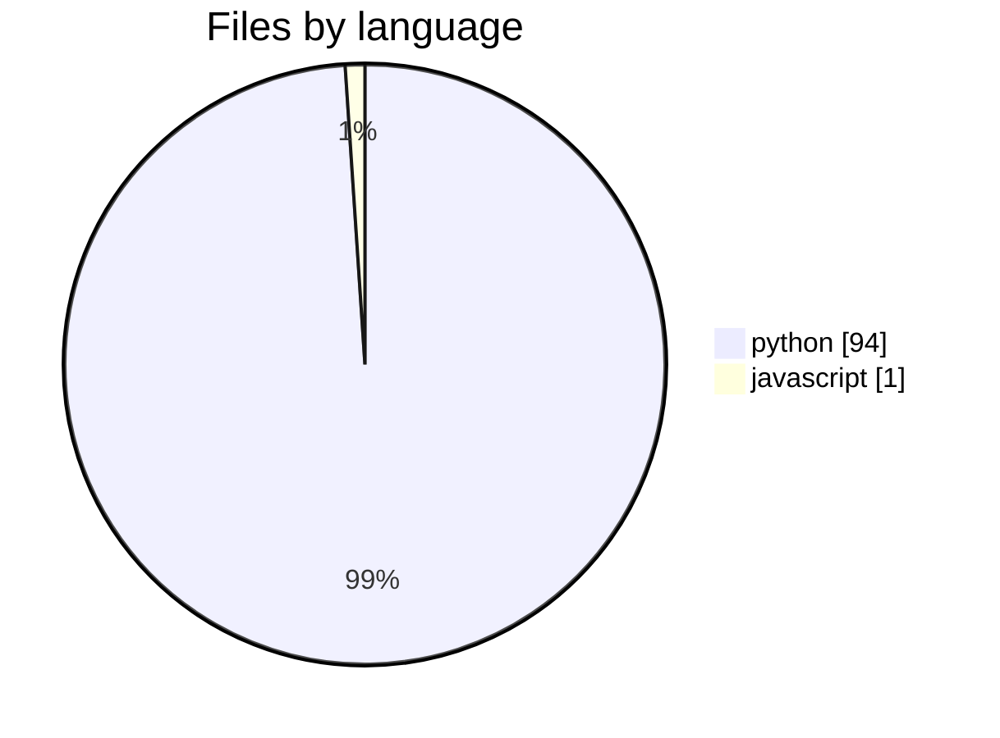
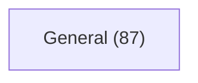

# probes — Repository Summary

> Built by Mnemos at 2026-09-07T16:27:09.535Z

## Overview

Single Package with 95 source files across python, javascript. 0 packages detected. core domains: General.

## Stats

| Metric | Value |
|--------|-------|
| Files scanned | 95 |
| Graph nodes | 707 |
| Graph edges | 2,269 |
| Domains discovered | 1 |
| Flows detected | 0 |
| Build time | 0.2s |

## Architecture Type

**Single Package** with layers:

## Languages

- **python**: 94 files
- **javascript**: 1 files

See **[languages.md](./languages.md)** for distribution charts and the Mnemos parsing pipeline.

## Packages

## Quick Navigation

- 1 logical domains
- 0 execution flows
- 0 API/route endpoints
- 0 services
- 50 architecture smells detected

## At a glance

## Languages in this repo

## Top domains

See **[graphs.md](./graphs.md)** for the full diagram set.
