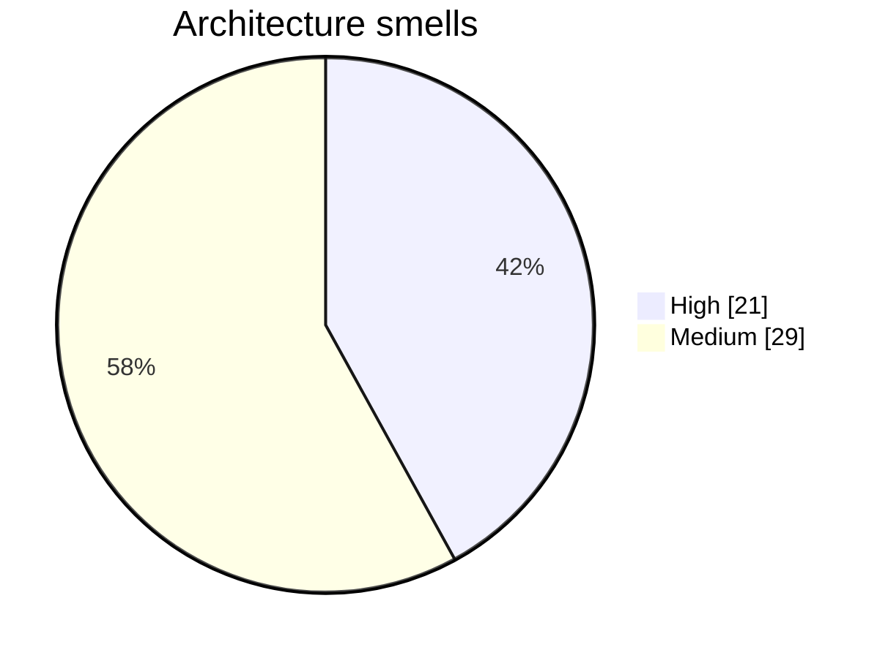

# Architecture Smells

50 potential issues detected.

## Smells by severity

## [HIGH] Excessive Fan In

affect.py has 34 incoming dependencies — high fan-in

**Recommendation**: Consider splitting this module or introducing a facade pattern

## [HIGH] Excessive Fan Out

affect3.py depends on 45 other nodes — high fan-out

**Recommendation**: Reduce dependencies by extracting shared utilities or applying dependency injection

## [HIGH] Excessive Fan Out

affect7.py depends on 66 other nodes — high fan-out

**Recommendation**: Reduce dependencies by extracting shared utilities or applying dependency injection

## [HIGH] Excessive Fan In

fanout.py has 32 incoming dependencies — high fan-in

**Recommendation**: Consider splitting this module or introducing a facade pattern

## [HIGH] Excessive Fan Out

langval.py depends on 59 other nodes — high fan-out

**Recommendation**: Reduce dependencies by extracting shared utilities or applying dependency injection

## [HIGH] Excessive Fan Out

audit02.py depends on 57 other nodes — high fan-out

**Recommendation**: Reduce dependencies by extracting shared utilities or applying dependency injection

## [HIGH] Excessive Fan In

affect2.py has 40 incoming dependencies — high fan-in

**Recommendation**: Consider splitting this module or introducing a facade pattern

## [HIGH] Excessive Fan In

_load_vectors has 37 incoming dependencies — high fan-in

**Recommendation**: Consider splitting this module or introducing a facade pattern

## [HIGH] Excessive Fan Out

apparatus11.py depends on 60 other nodes — high fan-out

**Recommendation**: Reduce dependencies by extracting shared utilities or applying dependency injection

## [HIGH] Excessive Fan Out

affect8.py depends on 54 other nodes — high fan-out

**Recommendation**: Reduce dependencies by extracting shared utilities or applying dependency injection

## [HIGH] Excessive Fan Out

board.py depends on 41 other nodes — high fan-out

**Recommendation**: Reduce dependencies by extracting shared utilities or applying dependency injection

## [HIGH] Excessive Fan Out

affect11.py depends on 50 other nodes — high fan-out

**Recommendation**: Reduce dependencies by extracting shared utilities or applying dependency injection

## [HIGH] Excessive Fan Out

affect13.py depends on 54 other nodes — high fan-out

**Recommendation**: Reduce dependencies by extracting shared utilities or applying dependency injection

## [HIGH] Excessive Fan Out

affect14.py depends on 59 other nodes — high fan-out

**Recommendation**: Reduce dependencies by extracting shared utilities or applying dependency injection

## [HIGH] Excessive Fan In

lab.py has 140 incoming dependencies — high fan-in

**Recommendation**: Consider splitting this module or introducing a facade pattern

## [HIGH] Excessive Fan In

_strip_bos has 34 incoming dependencies — high fan-in

**Recommendation**: Consider splitting this module or introducing a facade pattern

## [HIGH] Excessive Fan In

get_model has 66 incoming dependencies — high fan-in

**Recommendation**: Consider splitting this module or introducing a facade pattern

## [HIGH] Excessive Fan In

run has 32 incoming dependencies — high fan-in

**Recommendation**: Consider splitting this module or introducing a facade pattern

## [HIGH] Excessive Fan In

Steering has 34 incoming dependencies — high fan-in

**Recommendation**: Consider splitting this module or introducing a facade pattern

## [HIGH] Excessive Fan Out

triplet_capture.py depends on 48 other nodes — high fan-out

**Recommendation**: Reduce dependencies by extracting shared utilities or applying dependency injection

## [HIGH] Excessive Fan Out

site.py depends on 52 other nodes — high fan-out

**Recommendation**: Reduce dependencies by extracting shared utilities or applying dependency injection

## [MEDIUM] Excessive Fan Out

affect.py depends on 37 other nodes — high fan-out

**Recommendation**: Reduce dependencies by extracting shared utilities or applying dependency injection

## [MEDIUM] Excessive Fan Out

affect08s.py depends on 22 other nodes — high fan-out

**Recommendation**: Reduce dependencies by extracting shared utilities or applying dependency injection

## [MEDIUM] Excessive Fan In

affect3.py has 22 incoming dependencies — high fan-in

**Recommendation**: Consider splitting this module or introducing a facade pattern

## [MEDIUM] Excessive Fan In

AffectSteer has 22 incoming dependencies — high fan-in

**Recommendation**: Consider splitting this module or introducing a facade pattern

## [MEDIUM] Excessive Fan Out

affect3b.py depends on 27 other nodes — high fan-out

**Recommendation**: Reduce dependencies by extracting shared utilities or applying dependency injection

## [MEDIUM] Excessive Fan Out

affect3c.py depends on 39 other nodes — high fan-out

**Recommendation**: Reduce dependencies by extracting shared utilities or applying dependency injection

## [MEDIUM] Excessive Fan Out

affect3g.py depends on 39 other nodes — high fan-out

**Recommendation**: Reduce dependencies by extracting shared utilities or applying dependency injection

## [MEDIUM] Excessive Fan Out

affect4.py depends on 39 other nodes — high fan-out

**Recommendation**: Reduce dependencies by extracting shared utilities or applying dependency injection

## [MEDIUM] Excessive Fan Out

affect4b.py depends on 35 other nodes — high fan-out

**Recommendation**: Reduce dependencies by extracting shared utilities or applying dependency injection

## [MEDIUM] Excessive Fan Out

affect5.py depends on 33 other nodes — high fan-out

**Recommendation**: Reduce dependencies by extracting shared utilities or applying dependency injection

## [MEDIUM] Excessive Fan Out

apparatus09.py depends on 22 other nodes — high fan-out

**Recommendation**: Reduce dependencies by extracting shared utilities or applying dependency injection

## [MEDIUM] Excessive Fan In

topk has 25 incoming dependencies — high fan-in

**Recommendation**: Consider splitting this module or introducing a facade pattern

## [MEDIUM] Excessive Fan Out

audit03.py depends on 24 other nodes — high fan-out

**Recommendation**: Reduce dependencies by extracting shared utilities or applying dependency injection

## [MEDIUM] Excessive Fan Out

concepts.py depends on 25 other nodes — high fan-out

**Recommendation**: Reduce dependencies by extracting shared utilities or applying dependency injection

## [MEDIUM] Excessive Fan In

deepen.py has 22 incoming dependencies — high fan-in

**Recommendation**: Consider splitting this module or introducing a facade pattern

## [MEDIUM] Excessive Fan Out

deepen.py depends on 20 other nodes — high fan-out

**Recommendation**: Reduce dependencies by extracting shared utilities or applying dependency injection

## [MEDIUM] Excessive Fan In

assess has 18 incoming dependencies — high fan-in

**Recommendation**: Consider splitting this module or introducing a facade pattern

## [MEDIUM] Excessive Fan Out

langval2.py depends on 37 other nodes — high fan-out

**Recommendation**: Reduce dependencies by extracting shared utilities or applying dependency injection

## [MEDIUM] Excessive Fan In

loops.py has 24 incoming dependencies — high fan-in

**Recommendation**: Consider splitting this module or introducing a facade pattern

## [MEDIUM] Excessive Fan Out

loops.py depends on 36 other nodes — high fan-out

**Recommendation**: Reduce dependencies by extracting shared utilities or applying dependency injection

## [MEDIUM] Excessive Fan In

loop_gram has 24 incoming dependencies — high fan-in

**Recommendation**: Consider splitting this module or introducing a facade pattern

## [MEDIUM] Excessive Fan In

_null has 15 incoming dependencies — high fan-in

**Recommendation**: Consider splitting this module or introducing a facade pattern

## [MEDIUM] Excessive Fan Out

mirror.py depends on 20 other nodes — high fan-out

**Recommendation**: Reduce dependencies by extracting shared utilities or applying dependency injection

## [MEDIUM] Excessive Fan Out

mirror2.py depends on 33 other nodes — high fan-out

**Recommendation**: Reduce dependencies by extracting shared utilities or applying dependency injection

## [MEDIUM] Excessive Fan Out

nla.py depends on 37 other nodes — high fan-out

**Recommendation**: Reduce dependencies by extracting shared utilities or applying dependency injection

## [MEDIUM] Excessive Fan Out

og.py depends on 26 other nodes — high fan-out

**Recommendation**: Reduce dependencies by extracting shared utilities or applying dependency injection

## [MEDIUM] Excessive Fan Out

sorry4.py depends on 39 other nodes — high fan-out

**Recommendation**: Reduce dependencies by extracting shared utilities or applying dependency injection

## [MEDIUM] Excessive Fan Out

unit15.py depends on 31 other nodes — high fan-out

**Recommendation**: Reduce dependencies by extracting shared utilities or applying dependency injection

## [MEDIUM] Excessive Fan Out

unit15d.py depends on 39 other nodes — high fan-out

**Recommendation**: Reduce dependencies by extracting shared utilities or applying dependency injection
