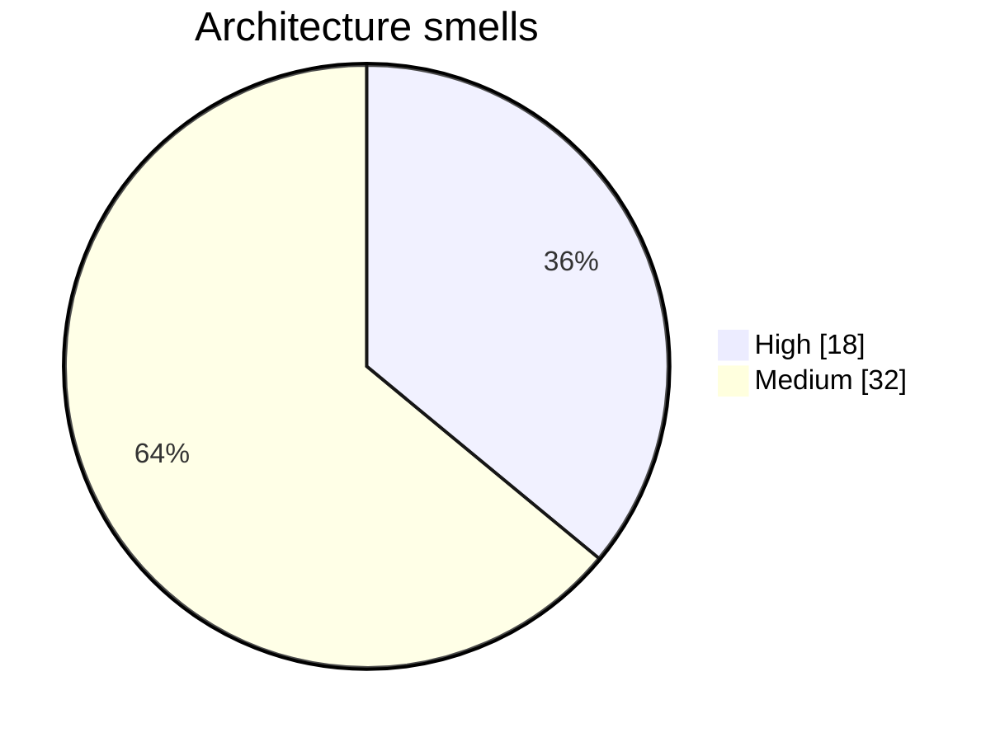

# Architecture Smells

50 potential issues detected.

## Smells by severity

## [HIGH] Excessive Fan Out

affect3.py depends on 47 other nodes — high fan-out

**Recommendation**: Reduce dependencies by extracting shared utilities or applying dependency injection

## [HIGH] Excessive Fan Out

affect3c.py depends on 41 other nodes — high fan-out

**Recommendation**: Reduce dependencies by extracting shared utilities or applying dependency injection

## [HIGH] Excessive Fan Out

affect3g.py depends on 41 other nodes — high fan-out

**Recommendation**: Reduce dependencies by extracting shared utilities or applying dependency injection

## [HIGH] Excessive Fan Out

affect4.py depends on 41 other nodes — high fan-out

**Recommendation**: Reduce dependencies by extracting shared utilities or applying dependency injection

## [HIGH] Excessive Fan Out

affect7.py depends on 68 other nodes — high fan-out

**Recommendation**: Reduce dependencies by extracting shared utilities or applying dependency injection

## [HIGH] Excessive Fan Out

langval.py depends on 59 other nodes — high fan-out

**Recommendation**: Reduce dependencies by extracting shared utilities or applying dependency injection

## [HIGH] Excessive Fan Out

sorry4.py depends on 41 other nodes — high fan-out

**Recommendation**: Reduce dependencies by extracting shared utilities or applying dependency injection

## [HIGH] Excessive Fan Out

audit02.py depends on 57 other nodes — high fan-out

**Recommendation**: Reduce dependencies by extracting shared utilities or applying dependency injection

## [HIGH] Excessive Fan Out

site.py depends on 51 other nodes — high fan-out

**Recommendation**: Reduce dependencies by extracting shared utilities or applying dependency injection

## [HIGH] Excessive Fan In

lab.py has 106 incoming dependencies — high fan-in

**Recommendation**: Consider splitting this module or introducing a facade pattern

## [HIGH] Excessive Fan In

_strip_bos has 34 incoming dependencies — high fan-in

**Recommendation**: Consider splitting this module or introducing a facade pattern

## [HIGH] Excessive Fan In

get_model has 54 incoming dependencies — high fan-in

**Recommendation**: Consider splitting this module or introducing a facade pattern

## [HIGH] Excessive Fan In

run has 30 incoming dependencies — high fan-in

**Recommendation**: Consider splitting this module or introducing a facade pattern

## [HIGH] Excessive Fan In

affect2.py has 30 incoming dependencies — high fan-in

**Recommendation**: Consider splitting this module or introducing a facade pattern

## [HIGH] Excessive Fan In

_load_vectors has 30 incoming dependencies — high fan-in

**Recommendation**: Consider splitting this module or introducing a facade pattern

## [HIGH] Excessive Fan Out

apparatus11.py depends on 60 other nodes — high fan-out

**Recommendation**: Reduce dependencies by extracting shared utilities or applying dependency injection

## [HIGH] Excessive Fan Out

affect8.py depends on 56 other nodes — high fan-out

**Recommendation**: Reduce dependencies by extracting shared utilities or applying dependency injection

## [HIGH] Excessive Fan Out

board.py depends on 41 other nodes — high fan-out

**Recommendation**: Reduce dependencies by extracting shared utilities or applying dependency injection

## [MEDIUM] Excessive Fan In

affect.py has 28 incoming dependencies — high fan-in

**Recommendation**: Consider splitting this module or introducing a facade pattern

## [MEDIUM] Excessive Fan Out

affect.py depends on 39 other nodes — high fan-out

**Recommendation**: Reduce dependencies by extracting shared utilities or applying dependency injection

## [MEDIUM] Excessive Fan Out

affect08s.py depends on 22 other nodes — high fan-out

**Recommendation**: Reduce dependencies by extracting shared utilities or applying dependency injection

## [MEDIUM] Excessive Fan In

AffectSteer has 16 incoming dependencies — high fan-in

**Recommendation**: Consider splitting this module or introducing a facade pattern

## [MEDIUM] Excessive Fan Out

affect3b.py depends on 29 other nodes — high fan-out

**Recommendation**: Reduce dependencies by extracting shared utilities or applying dependency injection

## [MEDIUM] Excessive Fan Out

affect4b.py depends on 37 other nodes — high fan-out

**Recommendation**: Reduce dependencies by extracting shared utilities or applying dependency injection

## [MEDIUM] Excessive Fan Out

affect5.py depends on 35 other nodes — high fan-out

**Recommendation**: Reduce dependencies by extracting shared utilities or applying dependency injection

## [MEDIUM] Excessive Fan Out

apparatus09.py depends on 23 other nodes — high fan-out

**Recommendation**: Reduce dependencies by extracting shared utilities or applying dependency injection

## [MEDIUM] Excessive Fan In

topk has 20 incoming dependencies — high fan-in

**Recommendation**: Consider splitting this module or introducing a facade pattern

## [MEDIUM] Excessive Fan Out

audit03.py depends on 24 other nodes — high fan-out

**Recommendation**: Reduce dependencies by extracting shared utilities or applying dependency injection

## [MEDIUM] Excessive Fan Out

concepts.py depends on 25 other nodes — high fan-out

**Recommendation**: Reduce dependencies by extracting shared utilities or applying dependency injection

## [MEDIUM] Excessive Fan In

deepen.py has 20 incoming dependencies — high fan-in

**Recommendation**: Consider splitting this module or introducing a facade pattern

## [MEDIUM] Excessive Fan Out

deepen.py depends on 20 other nodes — high fan-out

**Recommendation**: Reduce dependencies by extracting shared utilities or applying dependency injection

## [MEDIUM] Excessive Fan In

fanout.py has 24 incoming dependencies — high fan-in

**Recommendation**: Consider splitting this module or introducing a facade pattern

## [MEDIUM] Excessive Fan In

assess has 18 incoming dependencies — high fan-in

**Recommendation**: Consider splitting this module or introducing a facade pattern

## [MEDIUM] Excessive Fan Out

langval2.py depends on 37 other nodes — high fan-out

**Recommendation**: Reduce dependencies by extracting shared utilities or applying dependency injection

## [MEDIUM] Excessive Fan In

loops.py has 18 incoming dependencies — high fan-in

**Recommendation**: Consider splitting this module or introducing a facade pattern

## [MEDIUM] Excessive Fan Out

loops.py depends on 38 other nodes — high fan-out

**Recommendation**: Reduce dependencies by extracting shared utilities or applying dependency injection

## [MEDIUM] Excessive Fan In

loop_gram has 18 incoming dependencies — high fan-in

**Recommendation**: Consider splitting this module or introducing a facade pattern

## [MEDIUM] Excessive Fan In

_null has 15 incoming dependencies — high fan-in

**Recommendation**: Consider splitting this module or introducing a facade pattern

## [MEDIUM] Excessive Fan Out

lossmap.py depends on 20 other nodes — high fan-out

**Recommendation**: Reduce dependencies by extracting shared utilities or applying dependency injection

## [MEDIUM] Excessive Fan Out

mirror.py depends on 20 other nodes — high fan-out

**Recommendation**: Reduce dependencies by extracting shared utilities or applying dependency injection

## [MEDIUM] Excessive Fan Out

mirror2.py depends on 34 other nodes — high fan-out

**Recommendation**: Reduce dependencies by extracting shared utilities or applying dependency injection

## [MEDIUM] Excessive Fan Out

nla.py depends on 38 other nodes — high fan-out

**Recommendation**: Reduce dependencies by extracting shared utilities or applying dependency injection

## [MEDIUM] Excessive Fan In

decode has 27 incoming dependencies — high fan-in

**Recommendation**: Consider splitting this module or introducing a facade pattern

## [MEDIUM] Excessive Fan Out

og.py depends on 26 other nodes — high fan-out

**Recommendation**: Reduce dependencies by extracting shared utilities or applying dependency injection

## [MEDIUM] Excessive Fan In

probe.py has 16 incoming dependencies — high fan-in

**Recommendation**: Consider splitting this module or introducing a facade pattern

## [MEDIUM] Excessive Fan Out

unit15.py depends on 31 other nodes — high fan-out

**Recommendation**: Reduce dependencies by extracting shared utilities or applying dependency injection

## [MEDIUM] Excessive Fan Out

unit15d.py depends on 39 other nodes — high fan-out

**Recommendation**: Reduce dependencies by extracting shared utilities or applying dependency injection

## [MEDIUM] Excessive Fan Out

unit16.py depends on 26 other nodes — high fan-out

**Recommendation**: Reduce dependencies by extracting shared utilities or applying dependency injection

## [MEDIUM] Excessive Fan Out

unit19.py depends on 37 other nodes — high fan-out

**Recommendation**: Reduce dependencies by extracting shared utilities or applying dependency injection

## [MEDIUM] Excessive Fan Out

blind.py depends on 23 other nodes — high fan-out

**Recommendation**: Reduce dependencies by extracting shared utilities or applying dependency injection
