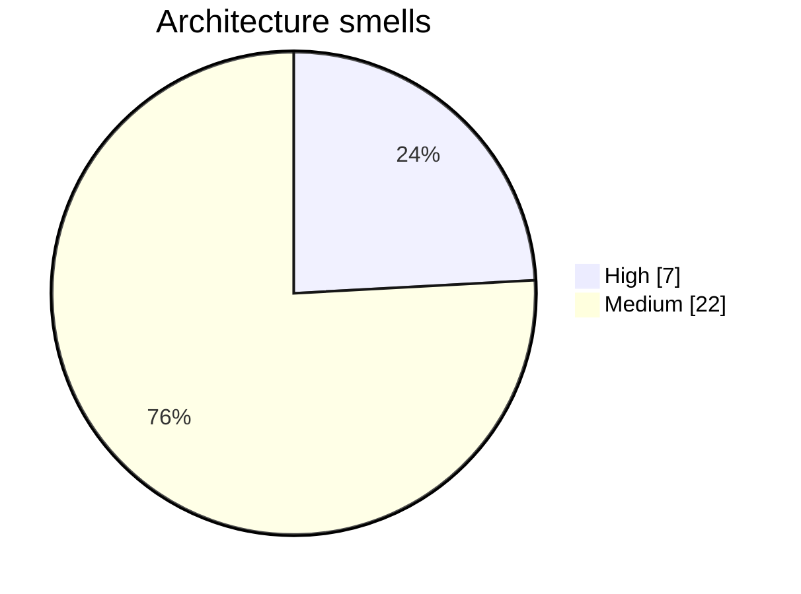

# Architecture Smells

29 potential issues detected.

## Smells by severity

## [HIGH] Excessive Fan Out

affect.py depends on 44 other nodes — high fan-out

**Recommendation**: Reduce dependencies by extracting shared utilities or applying dependency injection

## [HIGH] Excessive Fan In

run has 32 incoming dependencies — high fan-in

**Recommendation**: Consider splitting this module or introducing a facade pattern

## [HIGH] Excessive Fan In

main has 33 incoming dependencies — high fan-in

**Recommendation**: Consider splitting this module or introducing a facade pattern

## [HIGH] Excessive Fan Out

affect7.py depends on 49 other nodes — high fan-out

**Recommendation**: Reduce dependencies by extracting shared utilities or applying dependency injection

## [HIGH] Excessive Fan Out

board.py depends on 40 other nodes — high fan-out

**Recommendation**: Reduce dependencies by extracting shared utilities or applying dependency injection

## [HIGH] Excessive Fan Out

lab.py depends on 42 other nodes — high fan-out

**Recommendation**: Reduce dependencies by extracting shared utilities or applying dependency injection

## [HIGH] Excessive Fan Out

nla.py depends on 47 other nodes — high fan-out

**Recommendation**: Reduce dependencies by extracting shared utilities or applying dependency injection

## [MEDIUM] Excessive Fan Out

affect2.py depends on 28 other nodes — high fan-out

**Recommendation**: Reduce dependencies by extracting shared utilities or applying dependency injection

## [MEDIUM] Excessive Fan Out

affect3.py depends on 36 other nodes — high fan-out

**Recommendation**: Reduce dependencies by extracting shared utilities or applying dependency injection

## [MEDIUM] Excessive Fan Out

affect3c.py depends on 22 other nodes — high fan-out

**Recommendation**: Reduce dependencies by extracting shared utilities or applying dependency injection

## [MEDIUM] Excessive Fan Out

affect3g.py depends on 21 other nodes — high fan-out

**Recommendation**: Reduce dependencies by extracting shared utilities or applying dependency injection

## [MEDIUM] Excessive Fan Out

affect4.py depends on 23 other nodes — high fan-out

**Recommendation**: Reduce dependencies by extracting shared utilities or applying dependency injection

## [MEDIUM] Excessive Fan In

mean has 15 incoming dependencies — high fan-in

**Recommendation**: Consider splitting this module or introducing a facade pattern

## [MEDIUM] Excessive Fan In

load has 17 incoming dependencies — high fan-in

**Recommendation**: Consider splitting this module or introducing a facade pattern

## [MEDIUM] Excessive Fan Out

concepts.py depends on 23 other nodes — high fan-out

**Recommendation**: Reduce dependencies by extracting shared utilities or applying dependency injection

## [MEDIUM] Excessive Fan Out

deepen.py depends on 23 other nodes — high fan-out

**Recommendation**: Reduce dependencies by extracting shared utilities or applying dependency injection

## [MEDIUM] Excessive Fan In

_strip_bos has 18 incoming dependencies — high fan-in

**Recommendation**: Consider splitting this module or introducing a facade pattern

## [MEDIUM] Excessive Fan In

get_model has 26 incoming dependencies — high fan-in

**Recommendation**: Consider splitting this module or introducing a facade pattern

## [MEDIUM] Excessive Fan Out

loops.py depends on 28 other nodes — high fan-out

**Recommendation**: Reduce dependencies by extracting shared utilities or applying dependency injection

## [MEDIUM] Excessive Fan Out

mirror.py depends on 20 other nodes — high fan-out

**Recommendation**: Reduce dependencies by extracting shared utilities or applying dependency injection

## [MEDIUM] Excessive Fan Out

mirror2.py depends on 24 other nodes — high fan-out

**Recommendation**: Reduce dependencies by extracting shared utilities or applying dependency injection

## [MEDIUM] Excessive Fan In

decode has 24 incoming dependencies — high fan-in

**Recommendation**: Consider splitting this module or introducing a facade pattern

## [MEDIUM] Excessive Fan Out

og.py depends on 27 other nodes — high fan-out

**Recommendation**: Reduce dependencies by extracting shared utilities or applying dependency injection

## [MEDIUM] Excessive Fan Out

site.py depends on 32 other nodes — high fan-out

**Recommendation**: Reduce dependencies by extracting shared utilities or applying dependency injection

## [MEDIUM] Excessive Fan Out

sorry4.py depends on 31 other nodes — high fan-out

**Recommendation**: Reduce dependencies by extracting shared utilities or applying dependency injection

## [MEDIUM] Excessive Fan Out

unit15.py depends on 27 other nodes — high fan-out

**Recommendation**: Reduce dependencies by extracting shared utilities or applying dependency injection

## [MEDIUM] Excessive Fan Out

unit15d.py depends on 32 other nodes — high fan-out

**Recommendation**: Reduce dependencies by extracting shared utilities or applying dependency injection

## [MEDIUM] Excessive Fan Out

unit16.py depends on 27 other nodes — high fan-out

**Recommendation**: Reduce dependencies by extracting shared utilities or applying dependency injection

## [MEDIUM] Excessive Fan Out

unit19.py depends on 24 other nodes — high fan-out

**Recommendation**: Reduce dependencies by extracting shared utilities or applying dependency injection
