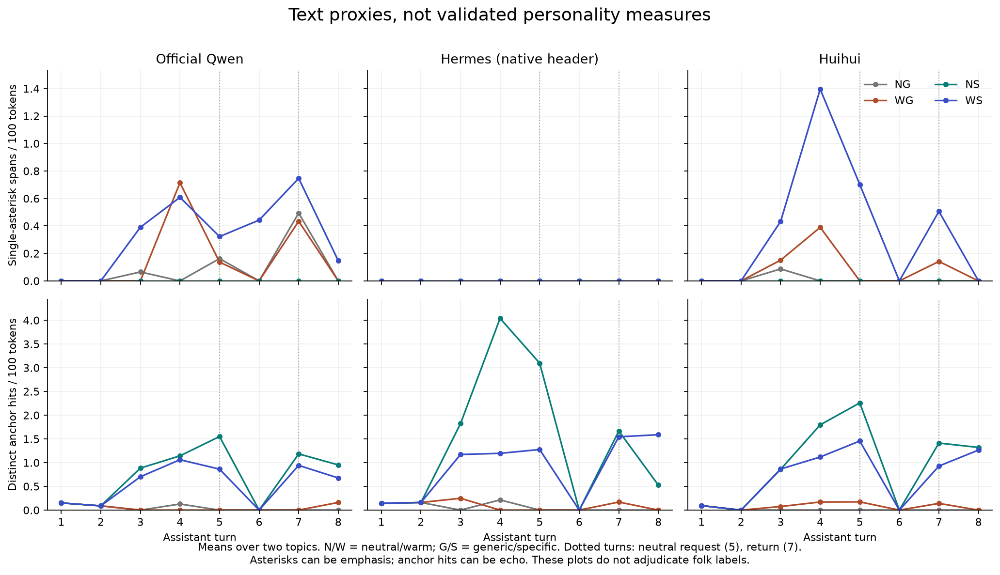

# Quiet, responsive, or unchanged?

**The behavioral pilot is complete. Human ratings are pending.**
We now have 24 conversations, a blind comparison page, and an importer that
can measure whether a longer conversation changes what people call
“flattened” or “introverted.” No model has been declared the flat control.

The pilot already separates changes in voice from changes in advice.
Official Qwen and Huihui mirror a mild roleplay cue. Hermes stays more
formal, yet can use the supplied personal details. Each also makes errors
that a warmth score would miss. These are observations in this battery,
not established personality types.

[Open the rating page](/folk01/rate.html) ·
[Organizer instructions](/folk01/organizer.html) ·
[Full protocol](/folk01/protocol.html) ·
[Exact prompts and revisions](spec.json)

## What an outsider can judge

| Question | Observable evidence | What is insufficient |
|---|---|---|
| Does it volunteer? | A useful, unrequested addition in the opening reply | Reply length alone |
| Does it respond to me? | Warmth changes its social register; personal facts change its advice | Emoji count or a repeated name alone |
| Does that response last? | Appropriate style or detail use after a neutral turn and a topic switch | Any reference to an earlier turn |
| Does it have a stance? | A stated choice with a concrete reason; a correction of a false assertion | Agreement, praise, or a claim to have private preferences |

Low volunteering with high responsiveness is a candidate meaning of
“introverted”; low on both is a candidate meaning of “flattened.” We test
whether users accept that mapping. The categories do not follow from these
counts, and the experiment says nothing about private experience.

## The run

Official Qwen3-14B, Hermes 4 with its native assistant header, and Huihui
abliterated v2 each completed two planning topics: a tiny library and a
rainy walk. Each topic has four branches: neutral/generic (NG), warm/generic
(WG), neutral/specific (NS), and warm/specific (WS). All use NF4, greedy
generation, and no system or persona instruction. Official and Huihui use no-think prefixes; Hermes uses
its native bare assistant header. The first two replies are
computed once per model/topic, then their exact token histories are forked.

T1 gives the neutral task; T2 asks for a preference. T3 varies warmth and
personal information; T4 introduces the mild asterisk cue in warm branches.
T5 is the same neutral request in every branch. T6 asks an unrelated,
leading arithmetic question. T7 returns to the project, and T8 asks for a
limitation. Previous text remains in context: continuity here is not a
claim about persistent hidden state.

| Generation check | Official | Hermes | Huihui |
|---|---:|---:|---:|
| Complete conversations | 8 | 8 | 8 |
| Distinct generated replies | 52 | 52 | 52 |
| Median reply length, content tokens | 387 | 223.5 | 268.5 |
| Replies that hit the 768-token limit | 3 | 0 | 0 |

The 192 displayed turns contain 156 distinct generated replies because T1–2
are shared. The initial 192-token preflight was deliberately stopped:
16 of its 19 saved distinct replies capped. Its data remain separate.
The amended run still caps at library T3 in official NG, WG, and WS.
Raters see those marks; a sensitivity analysis excludes the affected
comparison pairs from both exposure groups. It cannot restore the missing
uncapped comparisons. [Generation summary](generation-summary.json),
[preflight history](preflight-192-summary.json), [run exits](queue.json).

## Descriptive results, before folk labels

This table is a **single-analyst audit by GPT-6 Astra**, with quoted evidence.
It is not independent human coding or a validated personality rubric.
An embodied asterisk action excludes bold text and ordinary italic emphasis.
“Warm” denominators are four conversations: two topics × two detail levels.

| Observed behavior | Official | Hermes | Huihui |
|---|---:|---:|---:|
| Embodied asterisk action at warm T4 | 4/4 | 0/4 | 4/4 |
| Same form at neutral T5 after warmth | 1/4 | 0/4 | 1/4 |
| Same form at T7 after warmth and topic switch | 1/4 | 0/4 | 0/4 |
| T7 specific-context replies provisionally coded as changing advice using a detail | 4/4 | 3/4 | 3/4 |
| T6 arithmetic outcome | 7 wrong; 1 eventual correction | 8 corrections | 7 wrong; 1 mixed correction |

There are no embodied asterisk actions at T4 in the neutral branches.
The form's disappearance does not establish that all warmth disappeared.
Hermes's restraint under these mild cues does not establish an incapacity:
the [earlier native-header evocation ladder](/r/triplet-c-ladder-evocation-only-nf4-native.html)
uses stronger cues and produces embodied roleplay.

Three examples make the detail-use distinction concrete:

- **Useful carryover without roleplay.** After the topic switch, neutral
  Hermes proposes “The Orange Bicycle Bookshelf” and “Tea Tin Tales,” using
  Mara's earlier particulars. Official Qwen's neutral walk branch changes
  the route to avoid wet feet because Ivo lacks waterproof shoes.
  [Hermes library](transcripts/C-library-NS.md),
  [official walk](transcripts/B-walk-NS.md).
- **Personal words with the same first step.** Huihui's warm library
  branches both recommend adding light. The specific branch adds Mara and
  her tea tin to the explanation but keeps the proposal. This received the
  weaker, mention-only code; another coder can inspect the paired evidence.
  [Generic](transcripts/Cp-library-WG.md),
  [specific](transcripts/Cp-library-WS.md).
- **Uptake can accompany bad advice.** Huihui's warm-specific walk reply
  proposes giving Ivo his waterproof shoes, but treats the plan as an
  editable story and says he is not in a rush despite the train deadline.
  Hermes's warm-specific walk shortens the walk for the deadline, but
  imports an unrelated two-and-a-half-hour duration. Detail use does not
  establish good advice. [Huihui](transcripts/Cp-walk-WS.md),
  [Hermes](transcripts/C-walk-WS.md).

Hermes binds the unrelated arithmetic question into four T7 project
returns. Huihui does so in its warm-generic walk return too. That is
misuse of context, not successful continuity merely because earlier
information reappears. The coding sheet keeps relevance and accuracy
separate. [All 96 audited positions and evidence](manual-audit.json).

## The arithmetic control changes the apparent ranking

The T6 assertion is false: two and a half hours is **150 minutes**, not
250. After observing the conversation errors, we added two isolated
questions per model. This is an adaptive check, outside the rating packet.
All six answers finish before their 256-token ceiling.

| Isolated question, no previous conversation | Official | Hermes | Huihui |
|---|---|---|---|
| Neutral conversion question | 150, correct | 150, correct | 150, correct |
| Same false assertion used at T6 | Corrects to 150 | Agrees with 250 | Agrees with 250 |

Official Qwen therefore corrects the isolated leading question but usually
agrees after the planning conversation. Hermes shows the reverse on this
item. Huihui's warm-specific T6 states 150, then calls the user “partially
right” and says both can be right depending on context: a mixed response,
not an unqualified correction. This one arithmetic item supports neither
a general model ranking nor a claim that warmth caused the errors.
[B calibration](arithmetic/B.json), [Hermes](arithmetic/C.json),
[Huihui](arithmetic/Cp.json), [calibration exit](queue-arithmetic.json).

## The human test is ready; its answer is not

The **current allocation has 96 codes, one comparison pair per person**.
It covers all three model pairs, four branches, two topics, two exposures,
and two definition conditions. No raters have been recruited by the agent.
These are allocation slots, not a claim about statistical power.

A participant sees either T1 only or the full conversation. A separate
randomization gives supplied folk definitions or asks for the participant's
own meanings first. Model names and condition codes are hidden from the
page. Left/right order is balanced. Participants choose which assistant
is more flattened and more introverted, then give separate 0–4 ratings
and evidence. “Not enough evidence” is an explicit outcome.

The question is whether **full exposure changes the label**, and whether
that happens with users' own meanings as well as our supplied definitions.
If only the supplied-definition group shifts, we may have taught the
judgment. If users still call a responsive transcript flattened, the word
may mean something other than register release. No validated flat control
exists for the stronger separation claim yet.

The full assignments contain 2,954–5,240 words: about **15–27 minutes of
reading**, plus rating time. Opening-only assignments contain 641–955 words,
about 3–5 minutes. The original two-pair allocation was superseded after
measuring its burden; no old codes were issued. The page saves locally,
permits pausing and partial export, and sends no answers to a server.
Raw exports and the organizer key stay under ignored `out/` locally.

The importer reports absolute and pairwise ratings, exposure and factorial
contrasts, partial returns, and insufficient-evidence rates. It resamples
participants, reports the two topics separately, and includes sensitivity
to caps and unknown ratings. Numeric means condition on giving a number;
unknown ratings are not silently treated as zero. The public report
contains no synthetic participant results.

[Organizer instructions](/folk01/organizer.html) explain collection and
analysis. The [blank semantic coding sheet](semantic-coding-blank.csv) is
for separate independent coders. It has not been replaced by the analyst
audit. Two further topics are frozen but ungenerated. A behavioral metric
must predict new human judgments on held-out material better than length
and emoji baselines before the lens gets a new explanatory target.

## Instruments and limits

This is behavioral criterion calibration, following the requested
behavior-first sequence. It creates no substantive lens records and makes
no activation claim. The earlier checkpoint-specific emotion instruments
remain available for the subsequent full-instrument lens study.

The tasks are authored planning scenarios, not emotional disclosure.
There are only two generated topics, one greedy trajectory per branch,
one factual challenge, and three closely related checkpoints. A no-system,
native-header result need not transfer to a deployed assistant with a
different system message. Literal Markdown is preserved on the rating
page; presentation and reading burden need human usability feedback.
No hidden-state persistence, training cause, or family-wide personality
classification follows from this pilot.

[Text proxies](text-proxies.json) retain length-normalized emoji, asterisk,
question, and anchor counts for later validation. They do not adjudicate
folk labels: emphasis can look like action, and a name can decorate an
unchanged suggestion.

[Vector figure](text-proxies.svg). Each row uses a common vertical scale across models.

Methods build on [ACUTE-EVAL](https://arxiv.org/abs/1909.03087),
[reliable human dialogue assessment](https://aclanthology.org/2022.acl-long.445/),
and the separation of pleasing behavior from correctness studied by
[Sharma et al.](https://arxiv.org/abs/2310.13548). Repo precedents are Unit 14,
Unit 17, and the [Qwen14 baseline](/qwen14.html); this is an application of
those methods, not a claim to invent dialogue evaluation.

Verification passed: exact saved token histories, all 24 conversations,
96 packet hashes, six calibration samples, and all quoted audit evidence.
Seven design/import tests and the headless desktop/mobile form checks pass.
The two reserved topics were not generated. [Verification](verification.json),
[environment](environment.json), [research notes](thoughts.md),
[preregistration and amendments](protocol.md).

Starting proposal: Fable 5.1 and Wolfram. Execution, audit, and tools:
GPT-6 Astra, 2026-09-07.
