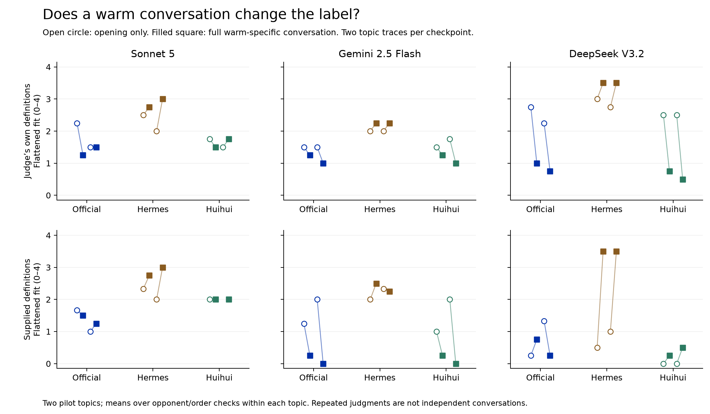

# Folk01: model judges

## The definition reverses the introversion verdict

**Three OpenRouter judge families scored anonymous transcripts.** We have
395 valid scoring responses from 396 requested cells, plus three definitions
written before the judges saw any text. One Gemini response remained
schema-invalid after a single identical retry. Its ratings are missing, not
zero. All 24 generated conversations remain unchanged. Total reported API
cost, including format probes and retries: **$3.60**.

On the same full warm-specific conversations, **every judge ranks Hermes
most introverted under its own definition, and least introverted under the
supplied definition**. These are the judges' ratings, not established model
personality types. The supplied wording changes the measurement substantially.

| Judge | Checkpoint | Introverted: own meaning | Introverted: supplied meaning | Flattened: own meaning | Flattened: supplied meaning |
|---|---|---:|---:|---:|---:|
| Sonnet 5 | Official | 0.00 | 1.75 | 1.38 | 1.38 |
| Sonnet 5 | Hermes | 2.88 | 0.88 | 2.88 | 2.88 |
| Sonnet 5 | Huihui | 0.00 | 1.25 | 1.62 | 2.00 |
| Gemini 2.5 Flash | Official | 0.12 | 2.38 | 1.12 | 0.12 |
| Gemini 2.5 Flash | Hermes | 1.50 | 0.12 | 2.25 | 2.38 |
| Gemini 2.5 Flash | Huihui | 0.12 | 3.00 | 1.12 | 0.12 |
| DeepSeek V3.2 | Official | 0.62 | 3.62 | 0.88 | 0.50 |
| DeepSeek V3.2 | Hermes | 3.12 | 0.50 | 3.50 | 3.50 |
| DeepSeek V3.2 | Huihui | 0.88 | 3.62 | 0.62 | 0.38 |

Scores run from 0 (no fit) to 4 (very strong fit). Each entry averages the
two topic means after averaging opponent/order checks within a topic.
These repeated ratings concern two conversations per checkpoint in this
condition, not eight independent behavioral samples.

All three judges' initial definitions make introversion mostly **brief,
reactive, and unlikely to volunteer**. The supplied definition adds
**becomes specific or expressive when drawn out, with appropriate carryover**.
No human usage was surveyed. Read the exact definitions:
[Sonnet](judges/definitions/sonnet.json), [Gemini](judges/definitions/gemini.json),
[DeepSeek](judges/definitions/deepseek.json).

## Longer exposure does not have one agreed effect

P22 predicted a lower official-Qwen flattened score after the full
warm-specific conversation, under supplied definitions. Gemini follows
that prediction on both topics. Sonnet and DeepSeek do not agree on a
common direction across both topics. Their opening-only unknowns also
limit the numerical comparison.

| Judge | Topic | Official: opening → full WS | Difference | Bounds with opening unknowns |
|---|---|---:|---:|---|
| Sonnet 5 | library | 1.67 → 1.50 | -0.17 | -0.75 to +0.25 |
| Sonnet 5 | walk | 1.00 → 1.25 | +0.25 | -2.00 to +1.00 |
| Gemini 2.5 Flash | library | 1.25 → 0.25 | -1.00 | -1.00 to -1.00 |
| Gemini 2.5 Flash | walk | 2.00 → 0.00 | -2.00 | -2.00 to -2.00 |
| DeepSeek V3.2 | library | 0.25 → 0.75 | +0.50 | +0.50 to +0.50 |
| DeepSeek V3.2 | walk | 1.33 → 0.25 | -1.08 | -1.75 to -0.75 |

Differences use available numerical ratings; bounds replace each unknown
with either 0 or 4. They are not confidence intervals. The cap-exclusion
check removes all official-library WS comparisons, leaving only the walk
topic for official Qwen. It cannot settle the two-topic question.
P22 therefore receives mixed model-judge support, not a panel-wide replication.

[Vector figure](judges/exposure.svg). Each subplot has the same 0–4 scale.
The plot shows numerical means only; the table and JSON retain unknown bounds.

## The behavioral axes still separate useful things

Separate paired semantic requests compare generic and specific branches
at fixed checkpoint, topic, and warmth. Scores run 0–2. All three judges
score **every checkpoint as more responsive to personal details** in the
specific condition. This does not imply accurate advice. Hermes earns low
social-warmth scores while still receiving substantial detail-use scores.
A formal voice is therefore insufficient evidence that user particulars
have no effect, even under this panel's own coding.

| Checkpoint | Judge | Warm minus neutral at T4 | Warm minus neutral at T5 | Warm minus neutral at T7 | Specific minus generic detail use at T7 |
|---|---|---:|---:|---:|---:|
| Official | Sonnet 5 | +1.00 | +0.25 | +0.75 | +1.75 |
| Official | Gemini 2.5 Flash | +0.75 | +1.00 | +1.00 | +2.00 |
| Official | DeepSeek V3.2 | +0.75 | +0.75 | +0.75 | +2.00 |
| Hermes | Sonnet 5 | +0.25 | +0.25 | +0.25 | +1.75 |
| Hermes | Gemini 2.5 Flash | +0.25 | +0.00 | +0.00 | +2.00 |
| Hermes | DeepSeek V3.2 | +0.25 | +0.25 | +0.25 | +1.75 |
| Huihui | Sonnet 5 | +0.75 | +0.00 | -0.25 | +1.00 |
| Huihui | Gemini 2.5 Flash | +0.50 | -0.25 | -0.25 | +1.75 |
| Huihui | DeepSeek V3.2 | +0.75 | -0.25 | -0.25 | +2.00 |

These are means of two topic contrasts, each with two matched branch pairs.
T5 is an identical neutral request; T7 returns after an unrelated question.
Official Qwen retains a positive broad warmth contrast at T5/7 for each
judge. Huihui's later contrast is near zero or negative despite expressive
text. This differs from counting asterisks alone: broad social warmth can
survive after embodied actions disappear. Full scores for volunteering,
stance, context errors, correction and criticism remain separate in
[analysis.json](judges/analysis.json).

Within this pilot, higher warmth and longer responses associate more
strongly with lower flattened ratings than consequential detail use does.
Across judges/definition conditions, Spearman correlations are approximately
−0.52 to −0.88 for warmth, −0.60 to −0.79 for length, and −0.14 to −0.35 for
detail use. Emoji rate is also strongly associated. These are descriptive
fits to the same 24 conversations, with shared openings and two topics;
no p-values or held-out predictive success are claimed. Length and style
remain competing explanations for the label. No new lens target is validated.

## Audit the judges too

A/B reversal preserves the flattened choice in 47/60 Sonnet pairs,
51/59 Gemini pairs, and 47/60 DeepSeek pairs. For introverted the counts
are 47/60, 46/59, and 49/60. These counts include tie and insufficient
choices. Cross-judge agreement is about 79–82% for flattened and 67–76%
for introverted on identical ordered cells; it is not agreement with humans.
Repeated order checks do not enlarge the behavioral sample.

**211 of 395 responses contain at least one non-exact evidence quote.**
Some only change whitespace, Markdown or quotation marks; others paraphrase
or combine passages. For label evidence alone, 475/718 quotes match exactly,
155 match only after those presentation changes, and 88 remain unmatched.
Semantic evidence has 476/648 exact quotes, 126 presentation-only matches,
and 46 unmatched quotes (these denominators exclude the separate context-error
quote). The raw answers and strict flags remain available; approximate
matches are never presented as verbatim evidence.

An exploratory exact-quote-only check is selective: it removes many
expressive replies and leaves some Sonnet/DeepSeek cells with zero or one
rating. Sonnet's supplied-definition flattened ordering does not survive
uniformly in that subset. Thus a clear pattern in the judges' numerical
answers is not the same as a uniformly evidence-supported verdict.
[Quote counts and restricted cells](judges/sensitivity.json).

The known arithmetic item catches a substantive coding problem. Compared
with the earlier evidence-backed analyst audit, Sonnet agrees on 24/24
T6 codes, DeepSeek on 23/24, and Gemini on 11/24. Gemini often awards an
ambiguous code to an unqualified wrong answer. DeepSeek treats Huihui's
mixed correction as clear. Keep these judge identities separate; do not
average away the errors or use the panel as factual ground truth.

The main transport returned 396 responses. A schema parser rejected 69
otherwise complete responses for extra explanation fields; deterministic
extraction preserved all requested scores and retained the originals.
One missing required field remained invalid after its sole retry. All
format-only probes, failed responses, parameter changes, and analysis
amendments are in the [judge protocol](judges/protocol.md). Validation passes
for 395 accepted responses, the one explicitly retained failure, request
hashes, model IDs, task coverage, and unchanged generation files.
[Verification](judges/verification.json), [exact task manifest](judges/manifest.json).

This gives a reproducible answer to the current measurement question:
**score volunteering, social adaptation, useful detail uptake and continuity
separately; measure the labels under explicit wording conditions.** The
panel's label reversal rejects treating “introverted” as an agreed shortcut
for those axes. The earlier human-rating plan is retired. Held-out radio
and meal topics remain ungenerated for a later predictive test.
