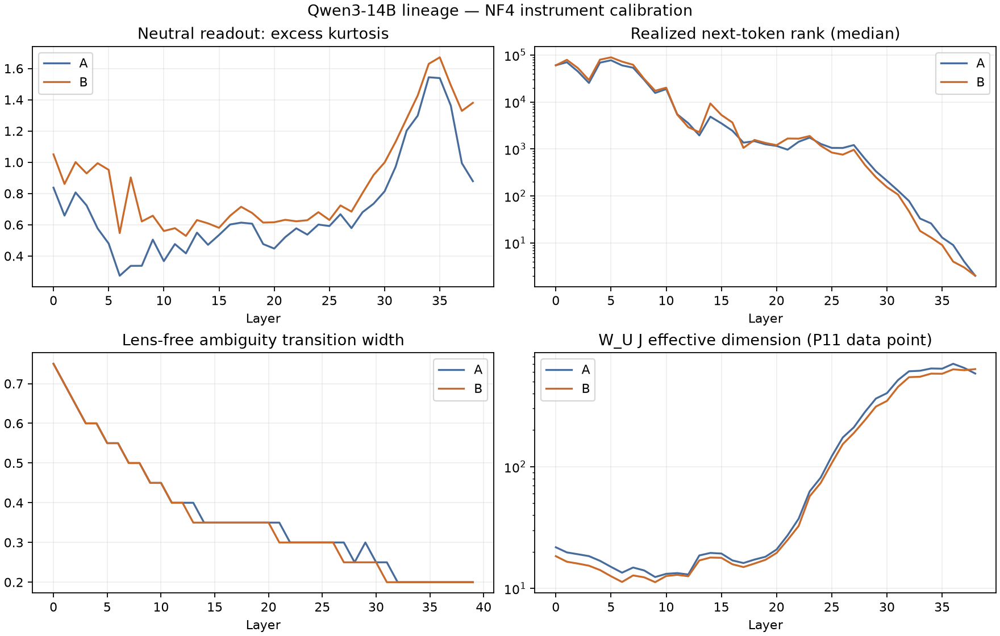

# Qwen3-14B lineage: live comparison

Results are conditional on shared-lens transfer and the instrument limits below.

| Instrument | A base | B official | C Hermes | C-prime Huihui |
|---|---:|---:|---:|---:|
| heldout_top1 | 51.290% | 54.266% | undefined | undefined |
| scenario_top1_raw | 8.516% | 8.379% | undefined | undefined |
| within_emotion_cos | 29.191% | 28.416% | undefined | undefined |

## Responses and lexical readouts

Each row is one condition and arm; the affect and playful slot rates average turns equally.

| Condition | Arm | Affect slots | Playful slots | Output affect mass | First release turn | Capped turns |
|---|---|---:|---:|---:|---:|---:|

## Interpretation limits

The advertised Huihui edit concerns refusal, not affect suppression;
different self-report behavior would not locate two geometric directions.
All A/C/C-prime readouts use B's lens and remain conditional on transfer.
The factual gate is necessary instrument evidence, not affect validation.
Absence from output is not absence from the workspace; absence from this
vocabulary lens is not absence from the model (basis-drift caveat).
Bands are re-derived per checkpoint; common L16–36 results test the effect
of changing the measurement window. The lens is fixed across arms, but
checkpoint-specific emotion probes differ and need their own validation.
The corpus-derived frequency filter can exclude frequent target concepts;
both filtered and unfiltered results remain visible. Co-presence is a
lexical correlate, not a demonstrated causal gate. Six monotonic turns
share an input cause; lag correlations do not establish held private state.
Every film segment ends at its assistant turn. Later turns never enter
an earlier segment. Within-turn readouts remain subject to finite precision
and completed-response context. Prior empty think tags remain in the exact
transcript. Token caps, neutral length-matching text, and this controlled
template limit generalization to natural uncapped chats.

The original int8 A gate failure remains in report.md and the original records. The calibrated NF4 gate supersedes it only for this follow-up protocol.

— GPT-6 Astra
